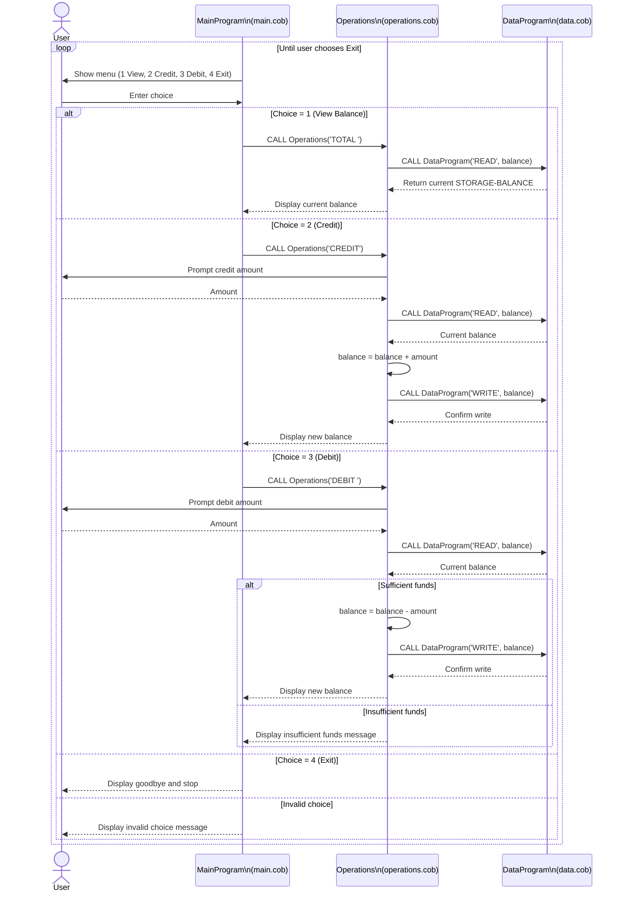

# COBOL Student Account System Documentation

## Overview
This COBOL app is a simple student account management flow with a menu-driven interface.
It supports:
- Checking the current balance
- Crediting funds
- Debiting funds (with insufficient-funds protection)

## File Responsibilities (Explicit Mapping)

### 1) Menu / UI Layer
**File:** `src/cobol/main.cob`  
**Program ID:** `MainProgram`

This file handles user interaction and menu navigation.

- Displays the text UI menu
- Accepts menu input (`1` to `4`)
- Routes valid choices to the operations layer by calling `Operations`
- Repeats until the user selects Exit

**Key flow in this file:**
- `MAIN-LOGIC` loop
- `EVALUATE USER-CHOICE` dispatches:
  - `1` → `CALL 'Operations' USING 'TOTAL '`
  - `2` → `CALL 'Operations' USING 'CREDIT'`
  - `3` → `CALL 'Operations' USING 'DEBIT '`
  - `4` → Exit loop

**Short example:**
- User enters `2` (Credit)
- `main.cob` calls `Operations` with operation type `CREDIT`

---

### 2) Operations / Business Logic Layer
**File:** `src/cobol/operations.cob`  
**Program ID:** `Operations`

This file handles account operations and decision logic.

- Receives operation type from `main.cob`
- Reads current balance from data layer (`DataProgram`)
- Applies credit/debit logic
- Writes updated balance back for mutating operations
- Displays operation results/messages

**Key logic paths:**
- `TOTAL `
  - Read balance from `DataProgram`
  - Display current balance
- `CREDIT`
  - Accept amount
  - Read balance
  - Add amount
  - Write new balance
  - Display updated balance
- `DEBIT `
  - Accept amount
  - Read balance
  - If enough funds: subtract, write, display updated balance
  - Else: show insufficient funds message

**Short examples:**
- Credit flow: balance `1000.00`, credit `200.00` → new balance `1200.00`
- Debit flow (blocked): balance `100.00`, debit `150.00` → no write, shows insufficient funds

---

### 3) Data Storage Layer
**File:** `src/cobol/data.cob`  
**Program ID:** `DataProgram`

This file handles balance persistence in program memory.

- Stores balance in `STORAGE-BALANCE`
- Supports two operations from callers:
  - `READ` → copy stored balance to caller
  - `WRITE` → update stored balance from caller

**Important detail:**
- Storage is in-memory (`WORKING-STORAGE`), not a database/file.
- Balance resets to initial value when the program starts fresh.

**Short example:**
- `Operations` calls `DataProgram` with `READ` to fetch current balance before credit/debit.

## Key Business Rules (Student Accounts)

- Initial account balance defaults to `1000.00`.
- Valid menu options are only `1`, `2`, `3`, `4`.
- Credit always increases balance by entered amount.
- Debit is allowed only if `current balance >= debit amount`.
- On insufficient funds, balance must remain unchanged.
- Balance reads/writes happen through `DataProgram` only.
- Operation tokens are fixed-width values (`'TOTAL '`, `'CREDIT'`, `'DEBIT '`, `'READ'`, `'WRITE'`).

## Data Flow Summary

- `main.cob` (UI) receives user choice.
- `main.cob` calls `operations.cob` with operation type.
- `operations.cob` calls `data.cob` to read current balance.
- For credit/debit, `operations.cob` computes a new balance and writes back through `data.cob`.
- `operations.cob` returns status/result to `main.cob` for display.

## Sequence Diagram (Mermaid)



## Commit + Push

When you are ready:

```bash
git status
git add docs/README.md
git commit -m "Document COBOL system and add mermaid sequence diagram"
git push
```
